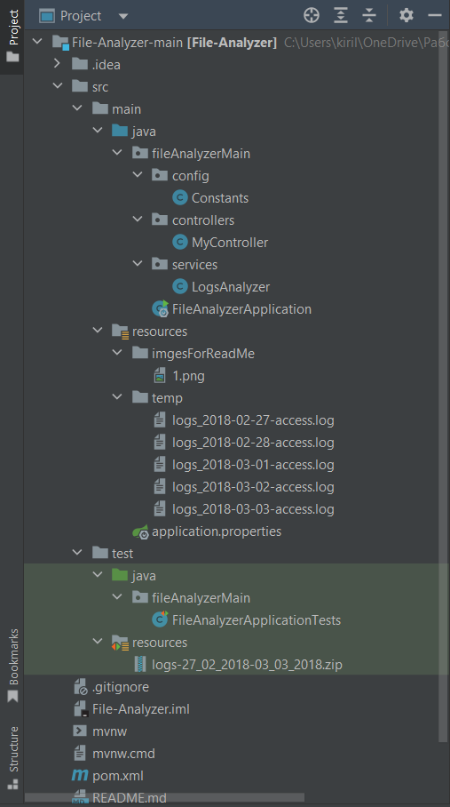

<h1 align="center">File Analyzer</h1>

----

----
## Stack
Java, Spring Boot, Maven, Lombok.
____
## Task
<details>
<summary>See more</summary>

___
# Count matching log file entries

## Introduction

Complete a `LogAnalyzer` class that should count number of lines which contains search string occurrences for files contained in a ZIP file. Each file name contains a date and you should check only files that are matching a given date range specified as `startDate` and `numberOfDays`. All files contained in a ZIP archive have following naming pattern: logs_<date>-access.log (for example: logs_2018-02-27-access.log).

## Problem statement

Your implementation of `LogsAnalyzer#countEntriesInZipFile' method should:

1. Iterate over files extracted from a ZIP file to a temporary directory.

2. Check if name of the file is matching a date pattern.

3. For each file matching date pattern count number of lines that contains search string.

4. Return a Map with a file name as a key, and number of lines with search string as a value.

## Example data


### ZIP file "logs-27_02_2018-03_03_2018.zip":
ZIP archive contains following files:
```
logs_2018-02-27-access.log
logs_2018-02-28-access.log
logs_2018-03-01-access.log
logs_2018-03-02-access.log
logs_2018-03-03-access.log
```

### Sample invocation
Following invocation should check three files from a ZIP archive, starting with `logs_2018-02-27-access.log` and files for next two days. For each file it should count lines that contains `"Mozilla"` search string.

```java
LogsAnalyzer logsAnalyzer = new LogsAnalyzer();
Map<String, Integer> entries = logsAnalyzer.countEntriesInZipFile("Mozilla", zipPath, LocalDate.of(2018, 2, 27), 3);
```

### Sample invocation result
```json
{
  "logs_2018-02-27-access.log" : 23,
  "logs_2018-02-28-access.log" : 18,
  "logs_2018-03-01-access.log" : 40
}
```
</details>

---
## Solution

---
### Project structure
<p align="center">
</p> 

---
### Request
```
GET http://localhost:9090?date=2018.02.27&numberOfDays=5&searchString=Mozilla
```
Controller method
```java
    @GetMapping()
    public ResponseEntity<Object> getLogsCount(@RequestParam String searchString,
                                               @RequestParam @DateTimeFormat(pattern = "yyyy.MM.dd") LocalDate startDate,
                                               @RequestParam int numberOfDays) {
        return ResponseEntity.ok(service.countEntriesInZipFile(searchString,
                Constants.ARCHIVE_PATH.toFile(),
                startDate,
                numberOfDays));
    }
```
Parameters:
- searchString - String;
- date - LocalDate;
- numberOfDays - Integer.

---
### Response
```json
{
    "logs_2018-03-02-access.log": 21,
    "logs_2018-03-01-access.log": 23,
    "logs_2018-03-03-access.log": 28,
    "logs_2018-02-27-access.log": 40,
    "logs_2018-02-28-access.log": 18
}
```